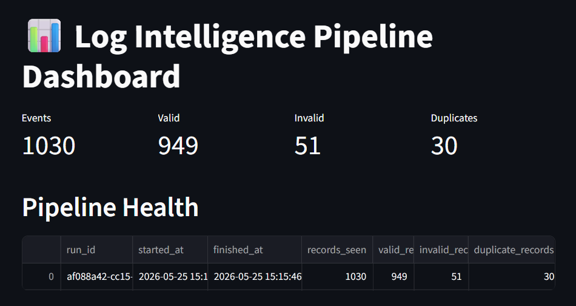
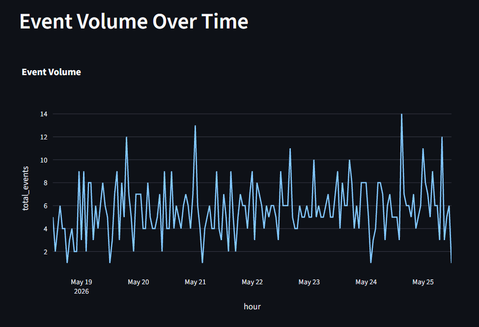
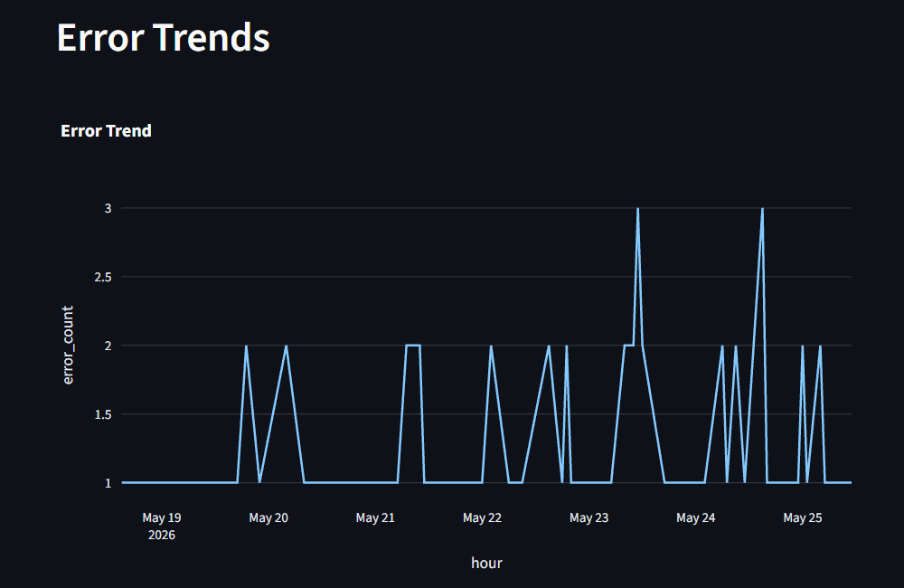
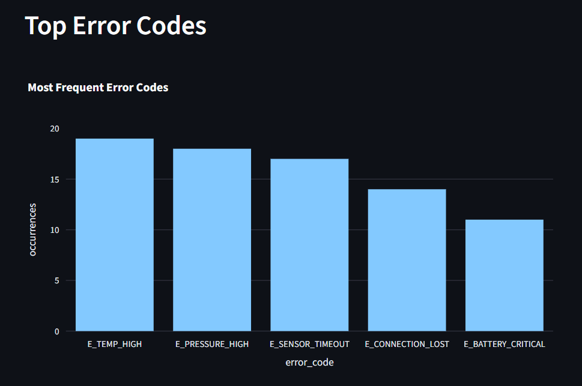
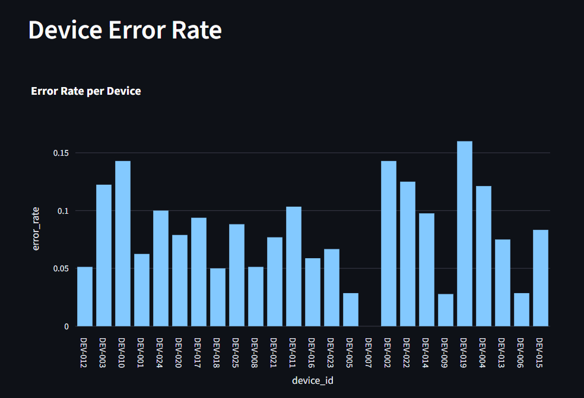
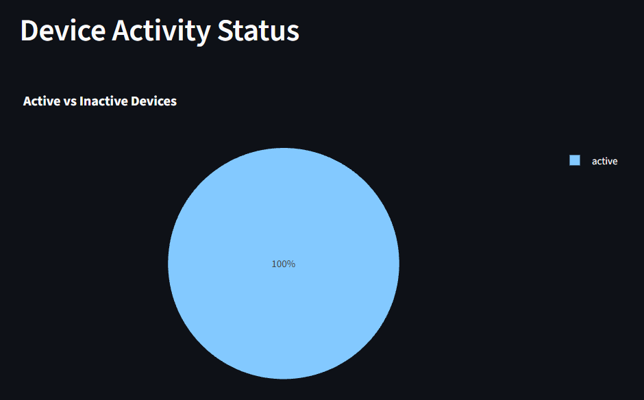
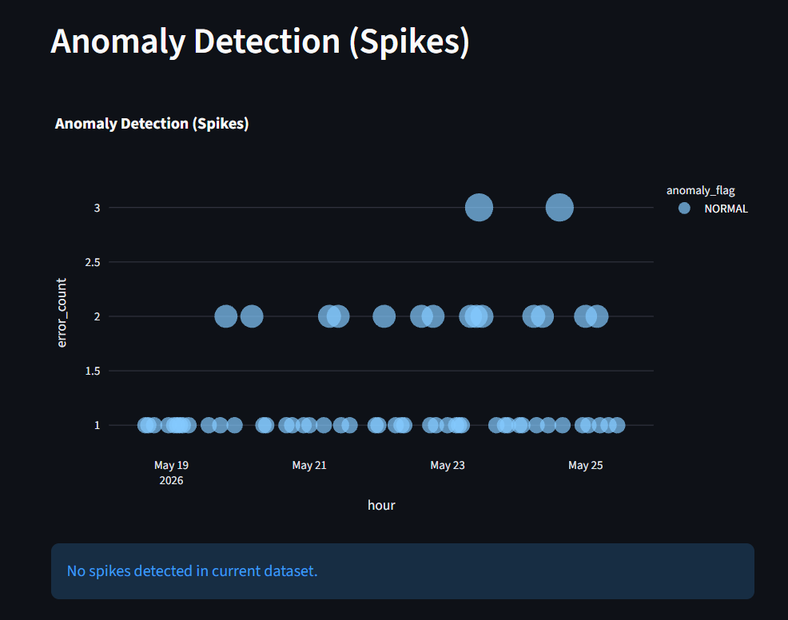

# 📊 Log Intelligence Pipeline

A local-first data engineering pipeline that transforms raw simulated device logs into structured analytical datasets, metrics, and interactive dashboards for monitoring and troubleshooting.

The project demonstrates a complete end-to-end data engineering workflow including ingestion, validation, transformation, analytics, data quality monitoring, and visualization using Python, SQL, DuckDB, and Streamlit.

---

## 🎯 Project Goals

The pipeline demonstrates:

- Log data ingestion from simulated device sources
- Validation of malformed, incomplete, and duplicate records
- Separation between raw, rejected, and analytical data
- SQL-based transformations and analytical metrics
- Storage in DuckDB, an embedded analytical database
- Dashboard visualization for troubleshooting and monitoring
- Basic data quality checks and pipeline observability

## 🧱 Architecture

```text
Simulated Device Logs
        ↓
JSONL Raw Files
        ↓
Python Ingestion Layer
  - validation
  - deduplication
  - rejection handling
        ↓
DuckDB Storage Layer
  - ingested_logs
  - pipeline_runs
        ↓
SQL Transformation Layer
  - events
  - devices
  - errors
        ↓
SQL Metrics Layer
  - time series analytics
  - error rates
  - anomaly detection
        ↓
Streamlit Dashboard
  - monitoring
  - troubleshooting
  - operational insights
```

## ⚙️ Technology Choices

### Python

Used for log generation, ingestion, validation, and pipeline orchestration.

### DuckDB

Embedded analytical database used for storing and querying structured log data. Enables fast SQL analytics without infrastructure overhead.

### SQL

Used for schema definition, transformations, aggregations, and metrics creation.

### Streamlit

Interactive dashboard for visualizing pipeline outputs and operational insights.

## 🔄 Pipeline Layers

| Layer | Responsibility |
| --- | --- |
| Ingestion | Parse logs, validate records, remove duplicates |
| Storage | Store clean logs in DuckDB |
| Transformation | Convert raw logs into analytical tables |
| Metrics | Compute KPIs and monitoring signals |
| Visualization | Dashboard for operational insights |
| Quality | Track invalid records, duplicates, pipeline runs |

## 📊 Key Metrics Implemented

- Event volume over time
- Error rate per device
- Most frequent error types
- Device activity, including active and inactive status
- Failure trends
- Mean time between errors (MTBE)
- Error spike detection with anomaly flagging

## 🧪 Data Quality & Observability

The pipeline tracks:

- Total processed records
- Valid records
- Invalid records rejected during ingestion
- Duplicate records skipped
- Pipeline execution runs with start and end timestamps

Invalid logs are stored separately in a rejected dataset for debugging and auditability.

## 📈 Dashboard Features

The Streamlit dashboard provides:

- Pipeline health overview
- Time-series event volume
- Error trend analysis
- Device-level error rates
- Top error categories
- Device activity status
- Anomaly detection for error spikes

## 📸 Dashboard Screenshots

#### 1. Pipeline Overview



Shows:

- `pipeline_runs` table
- KPI metrics for events, valid records, invalid records, and duplicates

#### 2. Event Volume Over Time



Shows:

- Time-series event volume chart

#### 3. Error Trends



Shows:

- Error trend line chart

#### 4. Top Error Codes



Shows:

- most frequent error codes across devices
- bar chart of error occurrences per error type
- distribution of system failures by category

#### 5. Device Error Rate



Shows:

- Error rate per device bar chart

#### 6. Device Activity Status



Shows:

- distribution of active vs inactive devices
- pie chart representing device availability status
- overall system health snapshot from connectivity perspective

#### 7. Anomaly Detection



Shows:

- Anomaly scatter plot with `NORMAL` and `SPIKE` labels
- Detected spikes table

## 💡 Example Insights

This pipeline enables the following insights:

### 1. System Load Patterns

Event volume over time reveals peak usage periods and system load behavior.

### 2. Device Reliability

Error rate per device identifies unstable or underperforming devices.

### 3. Failure Trends

Time-based error tracking helps detect degradation or improvement in system stability.

### 4. Operational Anomalies

Spike detection highlights unusual bursts of errors that may indicate incidents.

### 5. Device Activity Monitoring

Active vs inactive classification helps monitor connectivity and health of devices.

## 🚀 How to Run

### Create Virtual Environment

```bash
python -m venv .venv
```

Activate it on Windows PowerShell:

```powershell
.venv\Scripts\Activate.ps1
```

### Install Dependencies

```bash
pip install -e ".[dev]"
```

### Run Full Pipeline

```bash
python -m log_intelligence.pipeline
```

### Run Dashboard

```bash
streamlit run dashboard/streamlit_app.py
```

## 🧠 Summary

This project demonstrates a complete mini data platform:

- Raw log ingestion
- ETL pipeline design
- Analytical modeling
- SQL-based metrics
- Interactive visualization
- Data quality monitoring

Built as a production-style simulation of a real-world observability pipeline.
